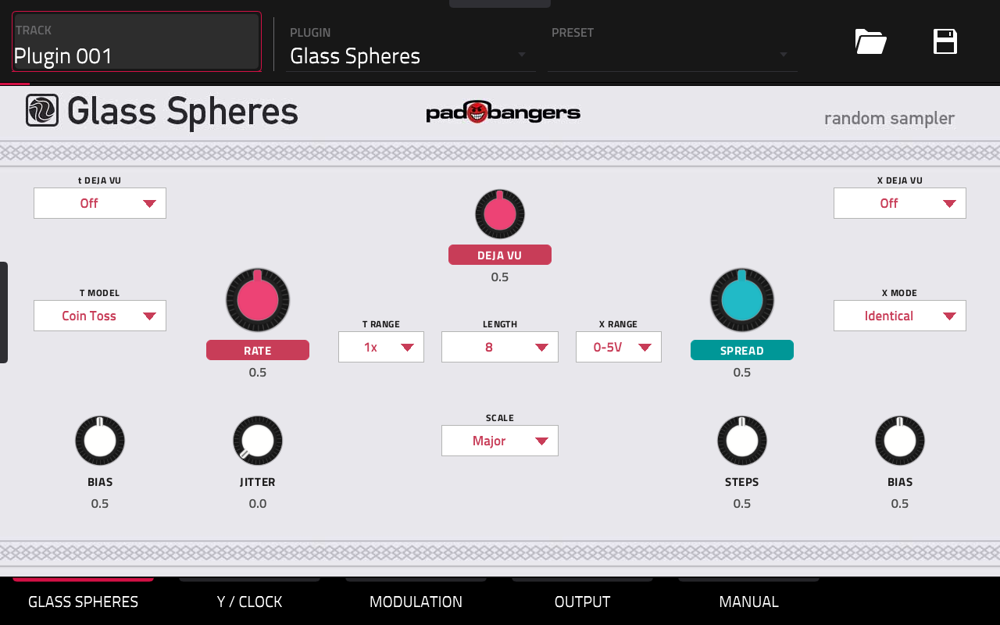
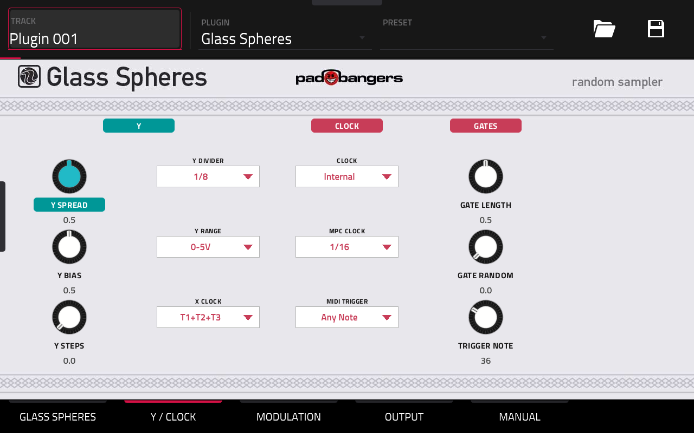
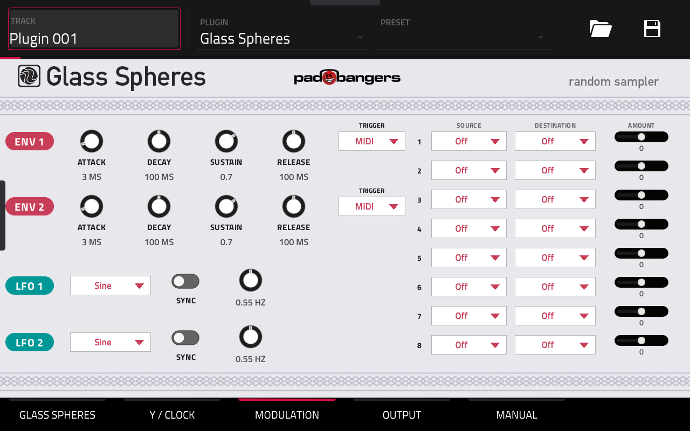
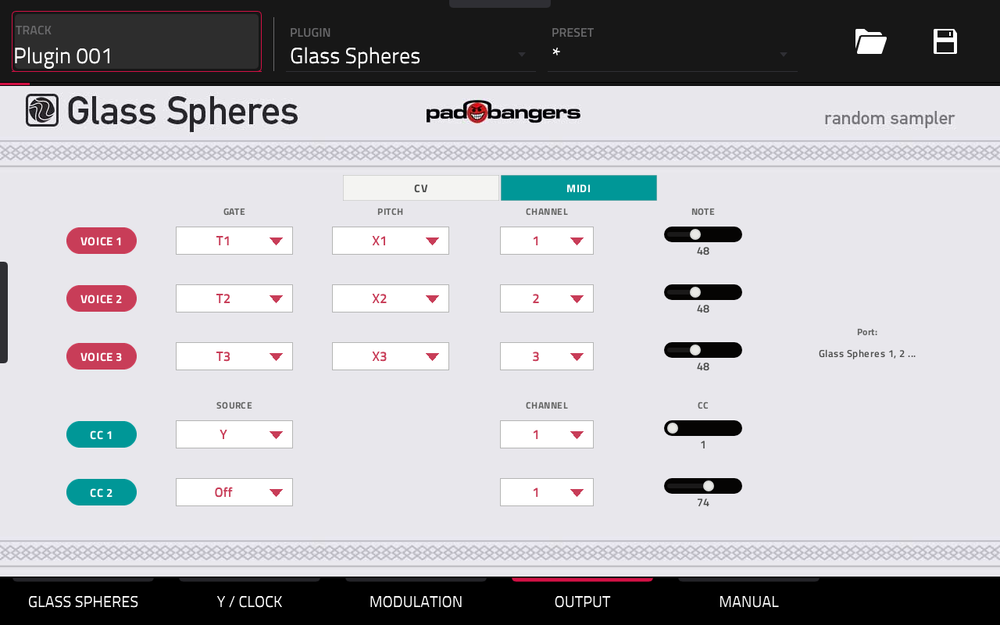
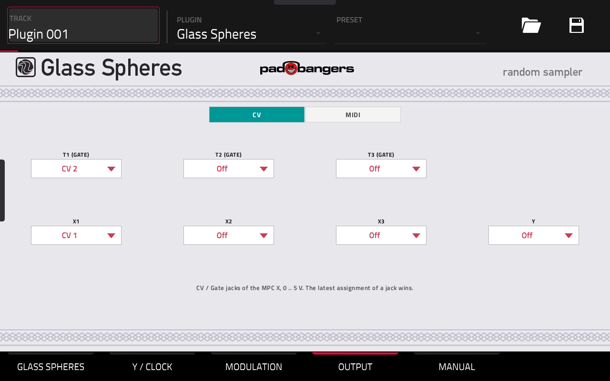
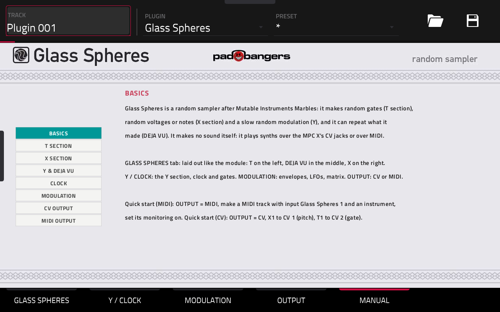

# Glass Spheres

**Glass Spheres** by Padbangers is a random sampler for Akai MPC standalone devices, after Mutable Instruments
Marbles: random gates, random (optionally quantized) melodies and a slow random modulation, with deja vu loops. It
makes no sound itself: it plays other tracks over **MIDI**, or analog gear over the **MPC X's CV/Gate jacks**.

- Marbles' T and X/Y generators (Emilie Gillet's code): seven T models, X spread/bias/steps with six scales, deja vu.
- **Clock:** internal, locked to the MPC's tempo and transport, or played by MIDI notes on its own track.
- **MIDI output:** three voices (gate T1-T3, pitch X1-X3/Y or a fixed note, own channel each) and two CC lanes.
- **CV output** (MPC X): the seven outputs on any of the eight jacks, 1 V/octave.
- **Modulation:** two envelopes, two LFOs and an 8-slot matrix onto Marbles' CV inputs, with its own outputs as
  sources (patched back, as on the module).
- A built-in manual on its own tab. **Beta:** the first release; please report what you find.








## Requirements

- A first-generation MPC OS standalone device with a 32-bit ARM CPU: **MPC Live / Live II, One, X, Key 61, Force**.
  Developed and tested on an MPC X. CV output needs an MPC X (the only one with CV/Gate jacks).
- **Root SSH access** to the device. Stock MPC OS doesn't offer this; you need a modded unit.
- Installing plugins this way is unofficial. Back up your projects and use it at your own risk.

## Install

1. Download `Glass-Spheres-<version>-mpc-armv7.zip` from the [Releases](../../releases) page and check its SHA-256
   against the release notes.
2. Unzip it and copy the folder to the device: `scp -r Glass-Spheres-<version> root@<device-ip>:/tmp/`
3. **Save your project**, then run the installer (it stops MPC, copies the plugin, backs up `MPC.settings`, adds the
   plugin to the list and starts MPC again): `ssh root@<device-ip> sh /tmp/Glass-Spheres-<version>/install.sh`
4. Add **Glass Spheres** from *Instrument plugins* (manufacturer Padbangers) on a track of its own.

Or install it with the [Plugin Manager](https://github.com/poloq-instruments/mpc-vst-manager) from the catalog.

## Using it

**GLASS SPHERES tab**, laid out like the module: T on the left (RATE, BIAS, JITTER, T MODEL, T RANGE), DEJA VU and
LENGTH in the middle, X on the right (SPREAD, BIAS, STEPS, X MODE, X RANGE), SCALE below LENGTH; t / X DEJA VU at the
top corners (off, on, locked). **Y / CLOCK:** the Y section, clock source, MPC clock note value, X clock, MIDI trigger,
gate length. **MODULATION:** as on [Overcast](https://github.com/FullPace/overcast). **OUTPUT:** CV or MIDI.

**MIDI:** MPC OS has no MIDI output for plugins, so every instance opens its own MIDI port, **Glass Spheres 1**,
**Glass Spheres 2**, ... On the track to be played (plug-in, keygroup, drum), pick it as the MIDI input with the
voice's channel and turn monitoring on. Defaults: voice 1 = T1 + X1 on channel 1, voice 2 = T2 + X2 on channel 2,
voice 3 = T3 + X3 on channel 3, Y as CC 1 on channel 1.

**CV:** each output to a jack (Off, CV 1-8); defaults X1 → CV 1, T1 → CV 2. 0-5 V at 1 V/octave; the ±5 V range is
squeezed into 0-5 V. Don't use the same jacks on CV tracks: the MPC sets those to 0 V on stop.

## Build from source

Needs Docker (with QEMU for 32-bit ARM containers), Python 3 and bash ≥ 4. The plugin framework is a submodule:

```sh
git clone --recursive https://github.com/FullPace/glass-spheres
cd glass-spheres
./build.sh            # -> build/glass_spheres.so + skin
./deploy.sh <host>    # copy to a device over ssh (--yes also registers it; restarts MPC)
```

The skin is generated: `python3 skin/gen_layout.py` (layout), `python3 skin/gen_params.py` (modulation params).
Developer notes, device findings and design decisions: [`CLAUDE.md`](CLAUDE.md); how the MPC X drives its CV jacks:
[`cv/README.md`](cv/README.md).

## Credits and licenses

- Glass Spheres: MIT, see [`LICENSE`](LICENSE).
- Marbles and stmlib by Emilie Gillet, MIT license — vendored in `third_party/eurorack/`.
- Plugin framework: [sd88me/mpc-vst-plugins](https://github.com/sd88me/mpc-vst-plugins) (submodule; build-time only).
- Not affiliated with Mutable Instruments or Akai Professional.
